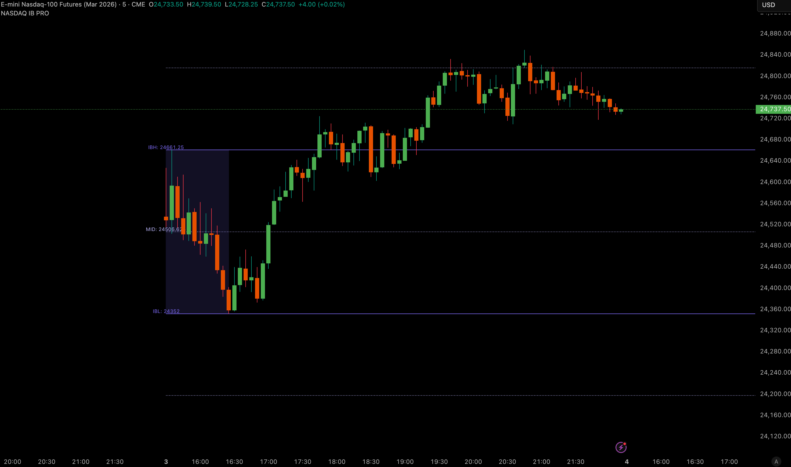
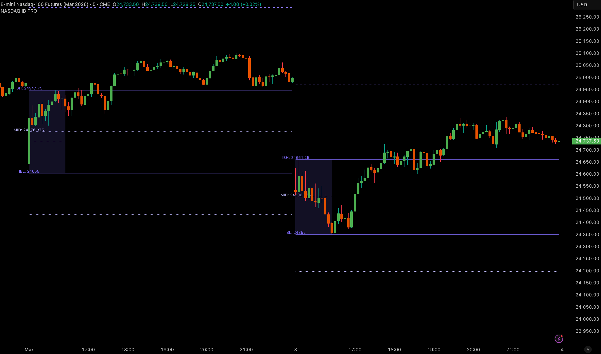

# NASDAQ Initial Balance Pro (US Cash IB)

**Session:** 15:30–16:30 UTC +1 (Exchange Time)  
**Market:** NQ / NASDAQ-100

## Features
- IB High / IB Low / Mid (50%)
- Range-based extensions: ±1x / ±2x
- Session-safe logic (no repaint / no shifting)
- Clean level memory + controlled history
- Alerts: IB formed, breakout/extension alerts
- Close/Wick confirmation + reclaim + once-per-day guard
- Clean UI, optimized objects, no warnings

## Screenshots
 
